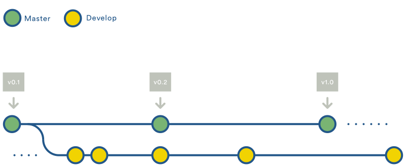
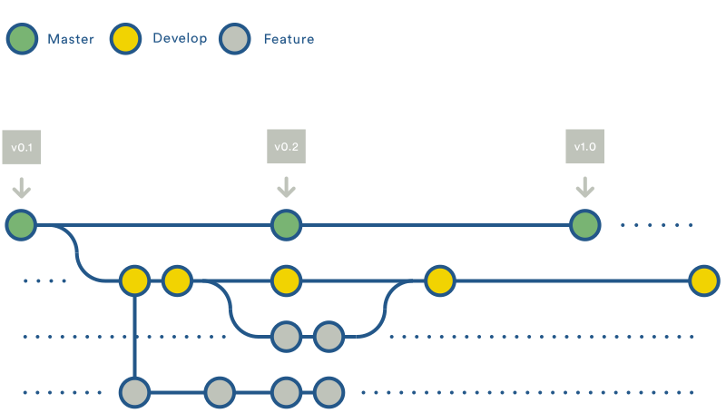
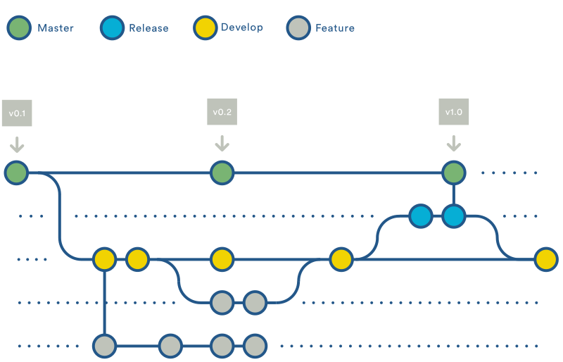
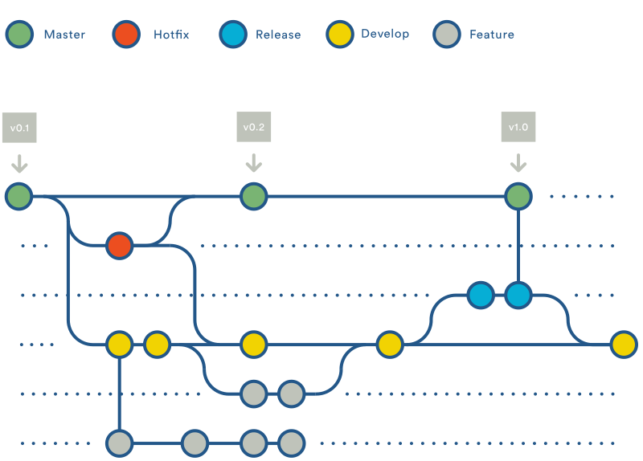

# GitFlow

O [Gitflow](http://danielkummer.github.io/git-flow-cheatsheet/index.pt_BR.html) é um fluxo de versionamento de código que também faz uso de um repositório central, como base para todos os desenvolvedores.A grande diferença aqui, é sua estrutura de _branches_.

## _Branches_ Principais (_Historical Branches_)
Ao invés de manter somente a a _branch_ `master`, esse fluxo faz uso também da _branch_ `develop` para a manutenção do histórico de desenvolvimento, servindo ela de _branch_ de integração para as `feature` _branches_.

## _Branches_ de Funcionalidades (_Feature Branches_)
Cada nova funionalidade a ser desendolvido em seu  projeto, deve ser iniciado em uma nova `feature` _branch_ derivada da `develop`, podendo ser submetida ao repositório remoto para fins de _backup_, ou para facilitar a colaboração. Assim que completo o desenvolvimento da nova funionalidade, sua respequitiva _branch_ deve ser _mergeada_ de volta a `develop` e finalizada. _Feature branches_ __jamais__ devem interagir com a _branch_ `master`.

## _Branches_ de Lançamento (_Release Branches_)
Assim que um grupo de funionalidades forem desenvolvidas, ou uma data de lançamento do produto é alcançada, já é possível _forkar_ a `develop` em uma `release` _branch_. Sendo assim, inicia-se um ciclo de lançamento e não são mais permitidos _commits_ de novas funcionalidades. Somente _commits_ de documentação, correção de _bugs_ ou tarefas relacionadas ao lançamento da versão devem ser feitas nessa _branch_.

Uma vez pronta, a versão deve ser _mergeada_ na `master` e tagueada com um número. Finalizando, a mesma versão deve também ser _mergeada_ na `develop` afim de acompanhar o progresso desenvolvido desde o início da _branch_ `release`.

## _Branches_ de Manutenção (_Maintenance Branches_)
As _branches_ de manutenção, chamadas de `hotfix`, são para lançamentos de pacotes diretamente em produção. Esse, é o único tipo de _branch_ que deve ser gerado diretamente da `master`. Assim que a correção estiver concluída, a mesma deve ser _mergeada_ tanto na `master` quanto na `develop` (ou então na atual `release`), e criada uma _tag_ na master com um número de versão atualizado.

